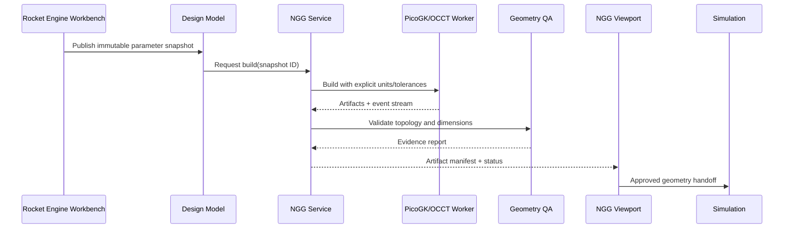

# Geometry data flow

```mermaid
sequenceDiagram
 participant R as Rocket Engine Workbench
 participant D as Design Model
 participant N as NGG Service
 participant W as PicoGK/OCCT Worker
 participant Q as Geometry QA
 participant V as NGG Viewport
 participant S as Simulation
 R->>D: Publish immutable parameter snapshot
 D->>N: Request build(snapshot ID)
 N->>W: Build with explicit units/tolerances
 W-->>N: Artifacts + event stream
 N->>Q: Validate topology and dimensions
 Q-->>N: Evidence report
 N-->>V: Artifact manifest + status
 V->>S: Approved geometry handoff
```

**Failure paths:** reject invalid units; cancel jobs; crash-recover worker; reject unverified export; retain last accepted revision.
