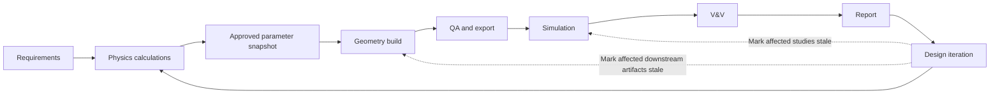

# Engineer journey and dependency invalidation

```mermaid
flowchart LR
 A[Requirements] --> B[Physics calculations]
 B --> C[Approved parameter snapshot]
 C --> D[Geometry build]
 D --> E[QA and export]
 E --> F[Simulation]
 F --> G[V&V]
 G --> H[Report]
 H --> I[Design iteration]
 I --> B
 I -. Mark affected downstream artifacts stale .-> D
 I -. Mark affected studies stale .-> F
```

A stale artifact remains readable and keeps its original evidence. It MUST NOT be relabeled as current.
