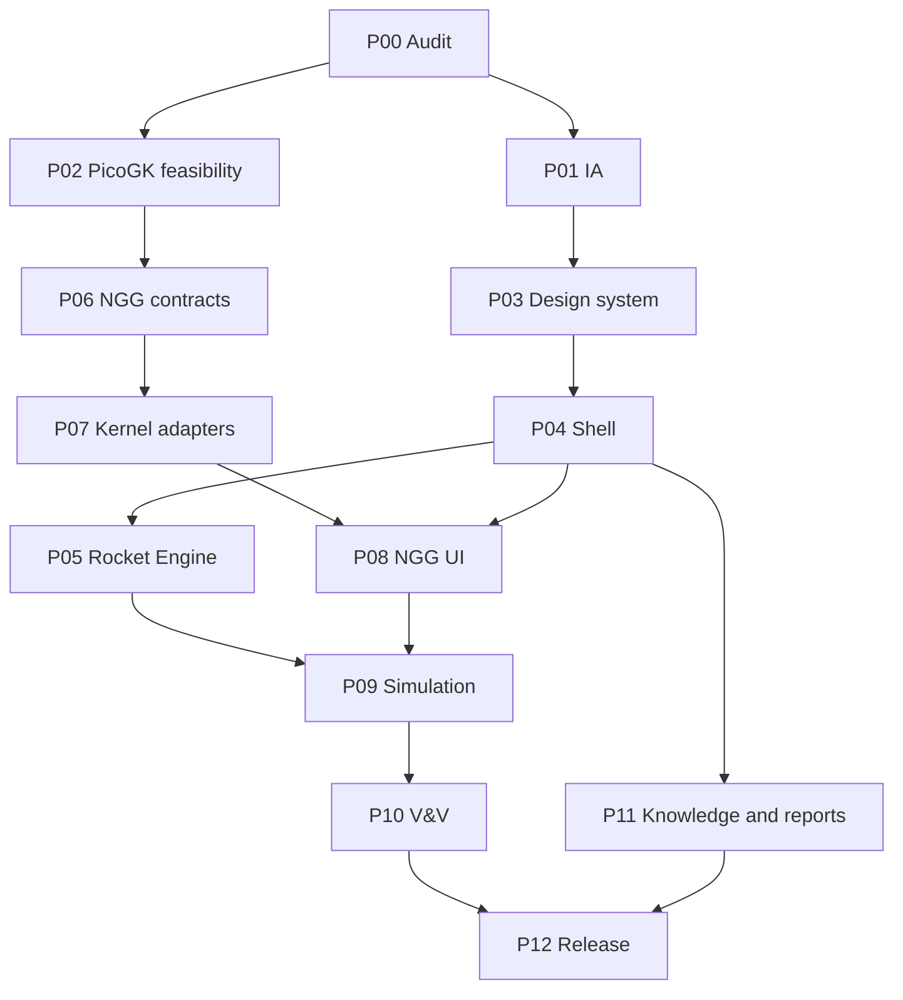

# Work package dependency graph

```mermaid
flowchart TD
 A[P00 Audit] --> B[P01 IA]
 A --> C[P02 PicoGK feasibility]
 B --> D[P03 Design system]
 D --> E[P04 Shell]
 E --> F[P05 Rocket Engine]
 C --> G[P06 NGG contracts]
 G --> H[P07 Kernel adapters]
 H --> I[P08 NGG UI]
 E --> I
 F --> J[P09 Simulation]
 I --> J
 J --> K[P10 V&V]
 E --> L[P11 Knowledge and reports]
 K --> M[P12 Release]
 L --> M
```
